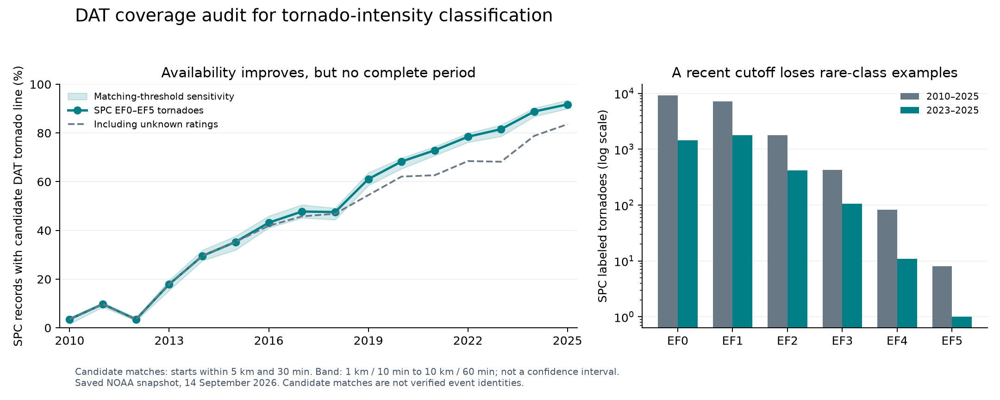

# DAT coverage evaluation and recommendation

**Recommendation: retain 2010–2025 for collection and the primary event-level EF-rating dataset. Use SPC as the event backbone, reconcile labels with NCEI, and treat DAT as optional survey enrichment. Do not require a DAT record to admit an event into the primary classifier.**

For a separate experiment that requires DAT features, use **2023–2025 as a provisional recent evaluation subset**, with 2021–2025 and 2017–2025 as explicitly audited expansion/sensitivity subsets. None is established as nationally complete. A three-year subset is too limited to support strong claims about all six EF classes, especially EF4/EF5.

This historical audit evaluates files saved by the former `download_data.ipynb` (collection now uses `download_data.py`). The download manifest was completed at **2026-09-14T17:59:44.018683+00:00**. No NOAA data was refreshed for this analysis, and the download notebook and raw files were not changed. Input checksums and reproducible matching outputs accompany the report.

## What was measured

The snapshot contains 20,164 SPC single-track records, 23,189 NCEI tornado county/event records, and 239,825 DAT features: 218,231 points, 11,585 lines, and 10,009 polygons. These units are different; dividing DAT feature counts by SPC tornado counts is not a valid coverage estimate.

The event-availability proxy is the fraction of SPC records whose **start location and start time** have at least one nearby DAT line labeled EF0–EF5, EF3+, or EFU. Other DAT line categories are excluded. The matching procedure does not use the SPC EF rating to select a match, so rating agreement and intensity-selection comparisons are not built into the matching rule.

- Standard: at most **5 km and 30 minutes** between start locations/times.
- Strict sensitivity: **1 km and 10 minutes**.
- Loose sensitivity: **10 km and 60 minutes**.
- Convert SPC `tz=3` to fixed CST (UTC−6), not daylight-saving Central time. All 20,164 records have that code. DAT schema time references are UTC; epoch milliseconds are converted accordingly. In this snapshot, every DAT line's `starttime` equals `stormdate`. The [SPC format specification mirrored by NOAA CPC](https://ftp.cpc.ncep.noaa.gov/hwang/HW/SSW/SPC_severe_database_description.pdf) documents `tz=3`; its older descriptions of other columns are not assumed current.
- NCEI comparisons use `BEGIN_DATE_TIME` and the explicit signed offset in `CZ_TIMEZONE`, according to the [NCEI bulk format](https://www.ncei.noaa.gov/pub/data/swdi/stormevents/csvfiles/Storm-Data-Bulk-csv-Format.pdf). NCEI event/segment starts may fall inside a longer DAT path, so these matches are a supplementary check, not a second independent tornado denominator.
- For EF classification, the primary denominator below is **SPC EF0–EF5 records only**. Unknown (`mag=-9`) records remain in the raw collection but are excluded from this supervised-label denominator. All-record and NCEI comparisons remain in the metrics file.

**These are candidate-availability estimates, not verified tornado joins or formal completeness percentages.** A neighboring tornado can produce a false candidate; revised coordinates, clock errors, track segmentation, or a delayed segment start can cause a missed candidate. Strict/loose ranges express matching sensitivity, not statistical confidence intervals or rigorous bounds on true coverage. Missing a DAT line does not prove that DAT has no points or polygons for that tornado. Point/polygon availability was assessed through inventory, field completeness, geometry, and identifier-link tests; a full spatial event association for those layers remains to be built.

## Temporal coverage

| Year | SPC EF0–EF5 | DAT tornado-labeled lines¹ | SPC with candidate | Standard proxy | Strict–loose | DAT points² | DAT polygons² |
| --- | --- | --- | --- | --- | --- | --- | --- |
| 2010 | 1302 | 62 | 46 | 3.5% | 1.5–4.2% | 984 | 9 |
| 2011 | 1704 | 214 | 166 | 9.7% | 8.6–10.3% | 5217 | 255 |
| 2012 | 948 | 125 | 33 | 3.5% | 2.8–4.1% | 2308 | 139 |
| 2013 | 916 | 210 | 164 | 17.9% | 15.4–19.5% | 11834 | 353 |
| 2014 | 928 | 367 | 274 | 29.5% | 27.6–31.9% | 8196 | 713 |
| 2015 | 1182 | 519 | 417 | 35.3% | 32.0–37.6% | 9355 | 600 |
| 2016 | 945 | 479 | 408 | 43.2% | 41.1–45.9% | 9092 | 407 |
| 2017 | 1376 | 764 | 657 | 47.7% | 45.1–50.5% | 16674 | 807 |
| 2018 | 1121 | 607 | 533 | 47.5% | 44.4–49.2% | 11941 | 563 |
| 2019 | 1349 | 927 | 824 | 61.1% | 58.5–63.7% | 16838 | 797 |
| 2020 | 984 | 743 | 672 | 68.3% | 65.3–69.7% | 18034 | 612 |
| 2021 | 1121 | 970 | 817 | 72.9% | 70.7–74.4% | 14133 | 721 |
| 2022 | 1012 | 905 | 794 | 78.5% | 76.2–79.9% | 13552 | 781 |
| 2023 | 1053 | 986 | 859 | 81.6% | 78.6–83.3% | 20021 | 953 |
| 2024 | 1549 | 1550 | 1376 | 88.8% | 86.8–90.3% | 27465 | 1388 |
| 2025 | 1149 | 1259 | 1054 | 91.7% | 90.0–93.5% | 32587 | 911 |

¹ Includes EFU and EF3+ DAT lines; not a numerator for the percentage. ² Includes all survey categories, not only tornadoes. DAT polygons may represent multiple intensity bands of one event.

The increase is substantial. For all SPC records including unknown ratings, the standard proxy increases from 3.5% in 2010 to 83.6% in 2025. For known ratings, it reaches 91.7% in 2025. The restricted set should therefore be identified explicitly whenever quoting a coverage percentage.

| Study period | SPC EF0–EF5 | With DAT candidate | Standard proxy | SPC EF4 | SPC EF5 |
| --- | --- | --- | --- | --- | --- |
| 2010–2025 | 18639 | 9094 | 48.8% | 83 | 8 |
| 2013–2025 | 14685 | 8849 | 60.3% | 49 | 2 |
| 2017–2025 | 10714 | 7586 | 70.8% | 29 | 1 |
| 2019–2025 | 8217 | 6396 | 77.8% | 27 | 1 |
| 2021–2025 | 5884 | 4900 | 83.3% | 18 | 1 |
| 2023–2025 | 3751 | 3289 | 87.7% | 11 | 1 |

A later start trades more consistent DAT availability for fewer labeled events and less coverage of rare severe tornadoes. In particular, changing the whole project to 2023–2025 would discard 14,888 of the 18,639 rated SPC events and seven of the eight EF5 events.

The low 2012 result also has a data-quality component: among DAT tornado lines with a nearby SPC start within 5 km on the same or adjacent UTC day, the nearest-location diagnostic finds 33 rounded offsets of −6 hours and 27 of −5 hours, versus 31 near zero. Examples include identical start coordinates with exact five- or six-hour discrepancies. This is consistent with possible time-zone encoding issues, but nearby records are not sufficient evidence to auto-correct times. The audit preserves the original times and records diagnostic examples. All lines remain sparse relative to SPC even before matching.

## Geographic and intensity selection

Even the 2023–2025 known-rating subset has uneven representation. Selected state examples below use the **SPC touchdown state**, not every state crossed by a tornado:

| State | SPC EF0–EF5, 2023–2025 | With DAT candidate | Standard proxy |
| --- | --- | --- | --- |
| CO | 44 | 21 | 47.7% |
| SD | 31 | 19 | 61.3% |
| FL | 174 | 120 | 69.0% |
| OK | 273 | 201 | 73.6% |
| TX | 238 | 215 | 90.3% |
| AL | 210 | 200 | 95.2% |
| IL | 312 | 306 | 98.1% |
| IN | 157 | 155 | 98.7% |

These contrasts persist after unknown-rated tornadoes are excluded. Geography, the mix of storms, and survey practices can all contribute; this audit does not attribute a causal share to any one explanation. State sample sizes matter, and no state is declared suitable solely because its pooled percentage is high. Office/year summaries from NCEI are also provided in the metrics for follow-up.

| Class | SPC 2010–2025 | DAT candidates 2010–2025 | Proxy within 2017–2025 | SPC 2023–2025 |
| --- | --- | --- | --- | --- |
| EF0 | 9197 | 3545 | 61.0% | 1452 |
| EF1 | 7149 | 4177 | 77.1% | 1767 |
| EF2 | 1776 | 1061 | 83.5% | 414 |
| EF3 | 426 | 260 | 89.6% | 106 |
| EF4 | 83 | 48 | 96.6% | 11 |
| EF5 | 8 | 3 | 100.0% | 1 |

During 2017–2025 the proxy is 61.0% for EF0, 77.1% for EF1, 83.5% for EF2, and 89.6% for EF3. Requiring DAT would select disproportionately toward stronger rated tornadoes. EF4/EF5 percentages have very small denominators and should not be interpreted as precise coverage estimates.

There are also **1,525 unknown-rated SPC events** in the full collection. Their standard proxy is only 15.2%. Do not convert unknown to EF0, infer a rating merely from absence of DAT, or label an unmatched storm as non-tornadic.

## Record quality and ability to combine layers

- **Candidate ambiguity:** 806 of the 9,326 SPC records with a standard candidate have multiple candidate DAT lines. Requiring one candidate in both directions yields 8,327 pairs. Of 8,157 such pairs with numeric EF0–EF5 labels in both sources, 8,024 agree (**98.4%**). The 133 disagreements require review; agreement is a useful diagnostic but does not independently verify identity because both sources share reporting origins.
- **Names are incomplete:** DAT `event_id` is absent on 129,071/218,231 points (59.1%), 4,064/11,585 lines (35.1%), and 4,678/10,009 polygons (46.7%). These are generally human-readable event labels, not NCEI's numeric `EVENT_ID`; do not join those columns directly.
- **GUID linkage is insufficient in this export:** the attempted `path_guid` → line `globalid` join resolves 2,266 points (1.0%) and 297 polygons (3.0%) to one line. This is a tested join hypothesis, not a verified universal foreign-key contract. Existing GUIDs often fail to resolve, and recent features frequently lack `path_guid`. Text/date/office proxies also leave many unlinked records and can collide; they are not substitutes for reviewed event associations.
- **Geometry is not always present:** 21 line, 174 polygon, and two point records have missing/empty geometry. In 2025 specifically, 97/911 polygon features (10.6%) lack geometry. Coordinate attributes can still permit a line-start candidate match even when its GeoJSON geometry is missing; availability of a candidate does not guarantee a usable footprint.
- **Survey categories and labels need explicit handling:** points include wind, tropical, unknown, EFU, and nonstandard values as well as EF0–EF5. `surveytype` is empty for all 218,231 points in this export. A point's EF rating describes a local observation, not necessarily the maximum rating of the tornado.
- **Photo availability is not established:** the saved `image` attribute is populated for 16,720 points overall and zero points from 2021 onward. This says nothing definitive about photos available through other DAT interfaces or attachment services. Photos were not downloaded or audited.
- All saved DAT batches passed their recorded checksums and feature-count checks. Every feature has `qc=Y`, but the [DAT service description](https://services.dat.noaa.gov/arcgis/rest/services/nws_damageassessmenttoolkit/DamageViewer/MapServer?f=pjson) still calls the data preliminary and directs users to NCEI for official statistics.

## Historical context and choice of period

The U.S. EF scale became operational on **February 1, 2007**, so 2008 is the first complete calendar year under it. **2010 is not a rating-scale transition or a DAT-completeness threshold.** EF is an estimate based on damage and exposure, not directly measured peak wind. [NWS EF-scale explanation](https://www.weather.gov/mob/aboutEFScale)

The DAT development team's [2017 AMS presentation](https://ams.confex.com/ams/97Annual/webprogram/Paper312451.html) reports experimental use since 2009 and, through 2016, broader use in Southern/Central NWS regions than in Eastern/Western regions. That history supports checking geography and year jointly rather than treating a single adoption date as uniform coverage. A [federal FY2023–2024 windstorm program report](https://www.nist.gov/system/files/documents/2026/02/11/FY23-24_NWIRP_Biennial%20Rpt_0.pdf) describes DAT becoming operational in FY2023. Fiscal-year operational status does not establish complete calendar-year 2023 records; the measured results above remain the basis for analysis.

Retaining 2010–2025 is a defensible project scope decision that keeps a longer EF-era sample and ends at a completed calendar year. If the goal later becomes maximizing all EF-era examples, extending the SPC/NCEI collection to 2008 is a separate reasonable expansion. This audit has not evaluated 2008–2009, and improved DAT coverage is not a justification for that extension.

## Updated recommendation for the EF-rating classifier

1. **Keep the downloader at 2010–2025 for all three sources.** No new common cutoff is justified by these results. Preserve provenance and report both requested and observed coverage.
2. **Build one row per tornado from SPC, with EF0–EF5 as the target.** Reconcile disputed labels and event histories against NCEI after linking and consolidating county segments. Do not duplicate a tornado for every county row or every survey point. Keep unknown-rated records available for separate analysis, outside supervised EF0–EF5 training.
3. **Make the primary model independent of DAT availability.** Use the full 18,639 labeled SPC events, subject to feature quality and reviewed event reconciliation. DAT may provide optional information, but its presence should not determine whether an event exists in the training or evaluation population.
4. **Treat DAT enrichment as a separate experiment.** Start with a reviewed 2023–2025 subset to assess matching, geometry, and required features; compare it with 2021–2025 and 2017–2025 expansions. Record why each event is retained or dropped, by year, state/office, and EF class. Compare a baseline and enriched model on the same held-out events, and also report baseline performance over the full eligible population. Do not claim that results from a well-surveyed regional subset generalize nationwide.
5. **Define what information the prediction is allowed to use.** For an independent estimate of tornado intensity, exclude EF labels, directly derived wind estimates, and narratives that disclose the rating. DAT `efscale`, `efnum`, `maxwind`, point `windspeed`, and NCEI `TOR_F_SCALE` must not leak into predictors. Damage indicators/degree of damage and path dimensions require a deliberate task definition: they may be legitimate inputs for a post-event assessment exercise, but that is different from forecasting intensity before damage is observed. These downloads alone do not supply radar or atmospheric predictors.
6. **Use event/outbreak-grouped, time-aware evaluation.** Keep all observations of one tornado together; consider grouping neighboring tornadoes from the same outbreak as well. Fit preprocessing on training data only. Report per-class counts, confusion matrices, macro-F1 and an ordinal error metric. With only eight EF5 examples over 16 years—and one since 2017—six-class performance at the top end will be highly uncertain. Class weighting does not create missing independent examples. Any class aggregation should be an explicit change in research question, not a silent cleanup step.

**Suggested notebook rationale:**

> We retain 2010–2025 as a fixed study period within the U.S. Enhanced Fujita scale era. SPC provides the tornado-level sampling frame, with NCEI used for event context and label reconciliation. DAT provides optional survey detail. An audit of the saved snapshot found that candidate DAT-line availability varies strongly by year, geography, and EF class; accordingly, DAT presence is not an inclusion criterion for the primary EF-rating dataset. DAT-dependent experiments use separately documented, reviewed subsets and do not assume nationwide completeness.

## Reproduction and scope

From the repository root, run `uv run python scripts/audit_dat_coverage.py` against the existing download. It uses the standard library, verifies the DAT batch hashes against their indexes, records index and reference-file hashes, and produces files in `reports/dat_coverage/`:

- `dat_coverage_metrics.json`: annual, window, state, office, label, field-quality, and timing summaries.
- `dat_spc_candidates.jsonl.gz` and `dat_ncei_candidates.jsonl.gz`: every reference record with its candidate lines under all three thresholds, including unmatched records.

Generate the figure with `uv run python scripts/plot_dat_coverage.py`; matplotlib is already a project dependency. It saves PNG and SVG files. Report prose describes this specific snapshot and should be reviewed if inputs are refreshed.

This evaluation does not resolve every cross-source event identity, manually adjudicate rating disagreements, inventory unseen photos/attachments, or test a classifier. It is sufficient to reject uniform-completeness assumptions and choose a conservative data strategy, while making those remaining preparation steps explicit.
